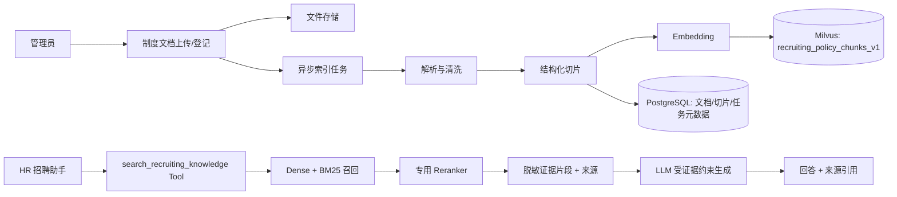

# 企业制度知识库 RAG 改造方案

## 1. 目标与边界

本方案为 HR 招聘助手增加“企业制度知识库问答”能力，帮助 HR 基于企业正式制度回答候选人的问题，例如年假、试用期、入职材料、招聘流程和面试安排。

本期的练习重点是：文档解析、结构化切片、混合检索、Rerank、带来源引用的问答，以及问答准确率评测。

### 1.1 本期目标

- 支持管理员上传或登记制度文档，并建立可追踪的索引。
- 支持 PDF、DOCX、Markdown、TXT 四类制度文档的文本解析。
- 基于标题层级和段落进行语义切片，避免仅按固定长度硬切。
- 使用 Milvus 实现 Dense + BM25 混合检索，并复用现有可配置 Reranker。
- 在 HR 招聘助手中通过 Tool 查询制度知识，回答时返回可点击或可定位的来源信息。
- 没有足够依据时明确说明“当前知识库未检索到相关制度依据”，禁止模型猜测企业事实。
- 建立可重复运行的离线评测集，持续优化切片和检索参数。

### 1.2 非目标

- 本期不直接面向候选人开放独立聊天入口；由 HR 使用助手后再对外答复。
- 本期不支持自动修改制度正文、自动审批或自动发送对外承诺。
- 本期不把原始 PDF、联系方式或其他敏感信息写入 Milvus。
- 本期不处理扫描件 OCR 质量优化；扫描 PDF 可先复用现有简历 OCR 能力，作为后续增强。

## 2. 复用原则与总体架构

本项目已经具备候选人混合检索能力。制度知识库不应复制一套新的 Embedding、Milvus、Hybrid 检索和 Rerank 代码，而应采用“**通用检索内核 + 业务应用适配层**”的方式建设。

通用内核以后可被产品客服、产品文档、运维知识库等场景复用；业务应用仍独立负责数据权限、事实源、Tool、提示词、前端产物和评测集。

### 2.1 当前代码的复用清单

| 当前模块 | 当前职责 | 制度知识库与后续场景的处理方式 |
| --- | --- | --- |
| `rag/embeddings.py` 的 `EmbeddingService` | 调用 Embedding API | 直接复用；模型、Base URL、Key、**单次批大小**继续从配置读取；`embed_documents` 必须按供应商上限分批 |
| `rag/milvus_client.py` | 创建 Milvus 客户端 | 直接复用 |
| `rag/retrieval_types.py` | 检索模式、请求、命中和去重契约 | 保留候选人兼容接口，逐步抽出不含 `candidate_id` / `profile_text` 的通用契约 |
| `rag/retrievers/milvus_hybrid_retriever.py` | Dense、BM25、RRF 混合召回 | 改为接收 Collection 与字段映射配置；候选人和制度分别传入自身配置 |
| `rag/rerankers/reranker.py` | 多云专用 Rerank API 适配 | 复用协议适配与日志；将输入从候选人画像扩展为通用文本命中 |
| `scripts/init_milvus.py` | 候选人 Collection 建表 | 抽取通用 Schema / Index 工厂；候选人与制度各保留独立初始化入口 |
| `scripts/evaluate_talent_search.py`、`rag/talent_search_evaluation.py` | 检索离线评测 | 复用评测加载、模式对比和报告结构；制度使用独立样本与指标 |
| `services/talent_search_service.py` | 候选人检索、权限复核、详情补全 | 保持候选人专用，不复用到制度知识库 |

### 2.2 必须保持隔离的业务责任

候选人搜索的 PostgreSQL 复核、职位/部门/候选人状态过滤、候选人详情补全，不能抽到通用 RAG 中；制度知识库也不应依赖候选人 Repository。

同理，后续产品客服应用需要自己的租户、产品版本、套餐、语言等权限与过滤规则。通用检索层只接收后端业务层已计算好的过滤表达式，绝不接受前端或 LLM 任意指定 Collection、权限范围或过滤条件。

### 2.3 通用知识库注册模型

第一版即引入轻量的知识库定义，而不是为每种业务复制数据库表和检索 Service：

```text
KnowledgeBaseDefinition
  ├─ key: recruiting_policy / product_support
  ├─ collection_name: recruiting_policy_chunks_v1 / product_support_chunks_v1
  ├─ schema_version 与 vector_dim
  ├─ text / dense_vector / sparse_vector / primary_key 字段映射
  ├─ 默认召回数量、Reranker 配置和最小证据阈值
  └─ visibility_policy: 由各业务 Service 实现，不允许前端传入
```

建议“一个知识库一个 Milvus Collection”，但所有 Collection 由同一个 Schema / Index 工厂创建。这样既能复用代码，也能隔离制度与客服文档的数据、索引版本、生命周期和访问范围。

不要在第一版预先建设万能低代码 RAG 平台；仅抽取当前候选人检索与制度知识库已经共用的部分。产品客服场景真正接入后，再基于第二个实际消费者继续收敛抽象。

### 2.4 通用扩展约束

本期**不开发产品客服或其他知识库场景**。产品客服仅作为验证抽象是否合理的示例：当第二个知识库应用真正出现时，应通过注册新的知识库定义、实现该业务的权限策略和展示适配来接入，而不是复制文档解析、切片、索引、检索和 Rerank 代码。

任何未来场景都需要自行提供数据来源、后端权限计算、可过滤字段、Tool/接口适配和独立评测集；这些都不属于当前 HR 制度知识库的开发任务。

若未来知识库需要租户、语言、产品版本等过滤字段，必须在该知识库 Collection 创建时声明为可过滤字段，并由 `CollectionSchema` 明确维护；不能依赖 Milvus 动态字段或让 LLM 拼接过滤条件。

### 2.4 总体架构



候选人检索、制度知识库和未来产品客服知识库的分层关系：

| 维度 | 候选人检索 | 制度知识库 RAG | 产品客服知识库（后续） |
| --- | --- | --- | --- |
| Collection | `candidate_search_profiles` | `recruiting_policy_chunks_v1` | `product_support_chunks_v1` |
| 核心数据 | 候选人画像 | 制度文档切片 | 产品说明、FAQ、排障文档切片 |
| 事实源 | PostgreSQL 候选人业务表 | 文件存储 + 制度元数据表 | 产品手册、FAQ、版本说明 |
| Agent Tool | `search_talent_pool` | `search_recruiting_knowledge` | `search_product_knowledge` |
| 输出 | 候选人卡片/详情 | 制度回答/来源引用 | 客服回答/来源引用/转人工提示 |
| 权限 | 候选人范围权限 | 制度可见范围权限 | 租户、产品版本、套餐、语言 |
| 可复用内核 | Embedding、Milvus、混合召回、Rerank、评测框架 | 同左 | 同左 |

## 3. 数据模型

### 3.1 知识库定义

新增 `knowledge_bases`，它是通用知识库的注册表，不存放具体业务权限判断：

| 字段 | 说明 |
| --- | --- |
| `id` | 知识库 UUID |
| `key` | 稳定业务标识，例如 `recruiting_policy`、`product_support` |
| `name` | 知识库名称 |
| `collection_name` | 对应的 Milvus Collection 名称 |
| `schema_version` | Collection 与切片结构版本 |
| `status` | `active`、`archived`、`indexing` 等 |
| `retrieval_config` | 可审计的默认召回与阈值配置，不存放密钥 |

`key` 只能由后端代码注册和使用，API 不允许客户端任意传入 Collection 名称。

### 3.2 文件与文档元数据

新增 `knowledge_documents`：

| 字段 | 说明 |
| --- | --- |
| `id` | 文档 UUID |
| `knowledge_base_id` | 所属知识库；制度与产品客服文档按此隔离 |
| `title` | 制度名称，例如“员工休假管理制度” |
| `category` | `leave`、`onboarding`、`recruiting`、`benefits` 等 |
| `storage_path` | 原文件存储路径或对象存储 Key |
| `file_name` / `file_type` | 原始文件信息 |
| `version` | 制度版本号 |
| `effective_date` | 生效日期 |
| `status` | `draft`、`active`、`archived`、`index_failed` |
| `visibility_scope` | `hr_only`、`all_employee` 等 |
| `content_hash` | 原文内容摘要，用于判断是否需要重建索引 |
| `created_by` / `updated_by` | 操作审计 |
| `indexed_at` | 最近成功索引时间 |

新增 `knowledge_index_tasks`，记录解析、切片、Embedding、写入 Milvus 的异步任务状态与错误摘要。

### 3.3 切片元数据

PostgreSQL 中可选保存 `knowledge_document_chunks`，用于审计、重建和页码/章节定位；Milvus 保存检索必要字段。

| 字段 | 说明 |
| --- | --- |
| `id` | 切片 UUID，也是 Milvus 主键 |
| `knowledge_base_id` | 所属知识库，用于审计与删除 |
| `document_id` | 所属制度文档 |
| `chunk_index` | 文档内稳定序号 |
| `section_path` | 标题路径，例如“第三章 > 年假规则” |
| `page_number` | 原文页码；无法可靠获取时为空 |
| `content` | 清洗后的切片正文 |
| `content_hash` | 切片幂等更新依据 |
| `token_count` | 切片长度审计 |

### 3.4 Milvus Collection

制度知识库首个实例使用 `recruiting_policy_chunks_v1`。建表逻辑必须由通用工厂生成，而非复制候选人 `scripts/init_milvus.py`；未来的 `product_support_chunks_v1` 复用同一工厂。

建议字段：

| 字段 | 类型 | 用途 |
| --- | --- | --- |
| `id` | VARCHAR | 主键，切片 ID |
| `knowledge_base_id` | VARCHAR | 知识库标识，便于审计与额外预过滤 |
| `document_id` | VARCHAR | 文档过滤与聚合 |
| `title` | VARCHAR | 展示来源 |
| `category` | VARCHAR | 分类过滤 |
| `version` | VARCHAR | 来源展示 |
| `effective_date` | INT64 或 VARCHAR | 版本优先级 |
| `visibility_scope` | VARCHAR | 权限预过滤 |
| `section_path` | VARCHAR | 来源定位 |
| `page_number` | INT64 | 来源定位 |
| `chunk_index` | INT64 | 稳定排序 |
| `content` | VARCHAR | BM25 输入文本 |
| `dense_vector` | FLOAT_VECTOR | 语义检索向量 |
| `sparse_vector` | SPARSE_FLOAT_VECTOR | Milvus BM25 Function 生成 |

原始文件、全文文本、上传人信息和任务异常堆栈不写入 Milvus。

所有知识库使用相同的基础字段（主键、文档、标题、章节、文本、Dense、Sparse、版本），各业务需要的 `tenant_id`、`language`、`product_version` 等过滤字段由自己的 `CollectionSchema` 显式追加。这使 HR 制度保持简洁，也不会限制产品客服后续的权限模型。

### 3.5 代码边界与渐进式抽象

为避免复制候选人检索代码，也避免一次性重写成熟功能，按以下边界演进：

```text
rag/                         # 通用、无业务权限的检索内核
  embeddings.py              # 保持复用
  milvus_client.py           # 保持复用
  retrieval_types.py         # 新增通用 SearchRequest / SearchHit 契约
  retrievers/                # 接收 CollectionSchema 配置的混合 Retriever
  rerankers/                 # 接收通用文本命中的 Reranker
  milvus_schema.py           # 通用 Collection Schema / Index 工厂

services/
  talent_search_service.py   # 保持候选人专用：权限复核、详情补全、候选人卡片
  knowledge_index_service.py # 新增：文档解析、切片、索引任务
  knowledge_search_service.py# 新增：知识库权限、检索、来源组装

knowledge/ 或业务模块目录
  recruiting_policy.py       # HR 制度的权限策略、默认配置、Artifact 适配
  <business>.py              # 未来业务出现后再增加其权限与 Artifact 适配
```

实现规则：

1. `MilvusHybridRetriever` 不再在内部读取候选人 Collection、字段名或候选人向量维度；改由 `CollectionSchema`（Collection 名、主键字段、文本字段、向量字段、输出字段、向量维度）传入。
2. 候选人侧构造 `candidate_search_profiles` 的 Schema 并保持现有 `TalentSearchService` 对外接口不变；制度与客服各构造自己的 Schema。
3. 通用命中使用 `id`、`text`、`score`、`metadata`；现有 `RetrievalHit(candidate_id, profile_text, ...)` 在第一轮重构中保留为候选人适配层，避免大范围破坏已通过的测试和 API。
4. Reranker 的 HTTP 协议适配、错误降级、脱敏日志直接复用；仅将输入文本从 `profile_text` 泛化为 `text`，并保留候选人兼容适配。
5. 检索层只负责 Milvus 查询、融合和排序；任何 PostgreSQL 回查、数据可见范围计算、文档有效性与租户过滤，都留在各自的业务 Service。

## 4. 索引构建流程

```text
根据 knowledge_base_key 创建/更新文档
  → 计算 content_hash
  → 创建索引任务
  → 提取文本与页码/标题信息
  → 清洗页眉页脚、重复空白和无意义目录
  → 按标题和段落切片
  → 写入 PostgreSQL 切片元数据
  → 按 EMBEDDING_BATCH_SIZE 分批生成 Embedding（保持切片顺序）
  → Upsert Milvus
  → 标记文档为 active、记录 indexed_at
```

索引任务必须幂等：同一 `knowledge_base_id + document_id + chunk_index + content_hash` 重复执行不产生重复向量；文档更新时应先删除本知识库中旧版本切片，再写入新版本切片。

索引入口只接收后端注册过的 `knowledge_base_key`。例如 HR 制度模块固定使用 `recruiting_policy`，后续客服模块固定使用 `product_support`；不能由请求参数指定任意 Milvus Collection。

### 4.1 Embedding 分批约束

制度文档可能切出远超单次 API 上限的切片数。`EmbeddingService.embed_documents` **不得**把整篇文档的全部切片一次性传给供应商；必须按配置分批请求，再按原顺序拼接向量。

| 配置项 | 默认值 | 说明 |
| --- | --- | --- |
| `EMBEDDING_MODEL` | `text-embedding-v4` | 与候选人检索共用 |
| `EMBEDDING_BASE_URL` | DashScope OpenAI 兼容地址 | 与候选人检索共用 |
| `EMBEDDING_BATCH_SIZE` | `10` | 单次 `embeddings.create` 的最大文本条数 |

当前默认值对齐 **DashScope text-embedding-v\*** 的限制：单次 `input.contents` 不得超过 10 条。若一次传入更多文本，供应商会返回 `400 InvalidParameter`（`batch size is invalid, it should not be larger than 10`），索引任务记为失败、文档状态变为 `index_failed`。

实现要求：

1. 分批逻辑集中在通用 `rag/embeddings.py`，制度索引与候选人回灌共用，避免各业务自行切割。
2. 每一批独立调用；任一批失败则整次索引任务失败并可重建，不写入半成品向量。
3. 批内仍按返回的 `index` 排序，批间按调用顺序拼接，保证与切片列表一一对应。
4. 更换供应商时只调整 `EMBEDDING_BATCH_SIZE`（及其他连接配置），不改索引编排代码。

真实验收中，上传《人力资源管理制度》Markdown 样例时曾因一次上传全部切片触发上述 400；修复分批后，对该文档执行「重建」即可恢复为可用。

## 5. 切片策略

### 5.1 第一版策略：结构优先的段落切片

1. 识别 Markdown 标题、DOCX 标题样式，或 PDF 中可恢复的章节标题。
2. 维护 `section_path`，例如“第二章 入职管理 > 2.3 入职材料”。
3. 先在同一章节内按自然段合并，再按长度切分。
4. 目标长度为 300～500 个中文字符；超过上限时按句子边界切开。
5. 相邻切片保留 60～100 个中文字符重叠，仅在同一章节中重叠。
6. 切片前附加制度标题和章节路径，帮助孤立片段保留语义。

切片文本示例：

```text
制度：员工休假管理制度
章节：第三章 年假规则
正文：员工累计工作已满一年不满十年的，享受五个工作日年休假……
```

### 5.2 后续可对比的策略

- 固定长度切片：作为对照组，不推荐作为默认方案。
- 父子切片：父块用于上下文，子块用于召回，适合长篇制度。
- 问答式增强：为高频制度章节生成检索别名，不直接替代原文证据。

每次调整切片策略都要生成新的 `chunk_version` 或重建新 Collection，避免新旧切片混杂导致评测不可复现。

## 6. 检索与回答链路

### 6.1 检索链路

```text
用户问题
  → 查询改写/结构化（可选）
  → Milvus Dense + BM25 召回（默认各 20 条）
  → RRF 融合
  → 专用 Reranker 重排（取前 5 条）
  → 文档去重与相邻切片合并
  → 返回证据片段与引用元数据
```

检索配置分两层管理：

- 公共模型连接配置（Embedding、Reranker 的供应商、URL、密钥，以及 Embedding 的 `EMBEDDING_BATCH_SIZE`）继续通过 `.env` 管理。
- 各知识库的模式、召回数量、输出上限、最低证据阈值通过后端 `KnowledgeBaseDefinition` 管理，可在数据库中记录可审计配置快照。

产品客服知识库可覆盖默认阈值与 Top-K，但不应复制一套 Embedding 或 Reranker 客户端配置。

### 6.2 回答约束

新增 `search_recruiting_knowledge` Tool，只返回已授权、脱敏的证据：

```json
{
  "query": "候选人问年假如何计算",
  "sources": [
    {
      "document_id": "...",
      "title": "员工休假管理制度",
      "version": "V2.1",
      "section_path": "第三章 > 年假规则",
      "page_number": 3,
      "content": "……",
      "score": 0.82
    }
  ]
}
```

系统提示词必须要求：

- 回答只能基于 Tool 返回的证据，不得把模型通用知识包装成公司制度。
- 每一条制度结论都附来源名称和章节；有页码时附页码。
- 证据冲突、过期或分数不足时，明确提示 HR 需向制度管理员确认。
- 不展示 Tool 原始参数、内部异常、模型推理过程。

### 6.3 与 HR 助手的集成

`HRAssistantAgent` 根据问题选择候选人 Tool 或制度 Tool；两者都命中时，分别输出候选人卡片和制度引用卡片。

前端 SSE 过程事件只显示“正在检索制度知识库”“已完成制度知识检索”；最终 `message_end` 的 artifact 增加 `knowledge_sources`，用于渲染制度来源卡片。

## 7. 权限与安全

- 制度可见性由后端代码计算，LLM 不可自行指定 `visibility_scope`。
- 第一版默认仅 HR 和超级管理员可使用制度问答，沿用 HR 助手入口权限。
- 已归档、未生效或无权访问的制度不得进入 Milvus 查询结果。
- 对候选人输出的内容仍需由 HR 人工确认；系统回答不构成对候选人的自动承诺。
- 日志仅记录文档 ID、切片 ID、耗时、分数区间和错误类型，不记录全文制度内容。

## 8. 管理接口与对话接口

第一版建议提供以下后端接口：

| 接口 | 用途 |
| --- | --- |
| `POST /knowledge/documents` | 上传/登记制度文档并创建索引任务 |
| `GET /knowledge/documents` | 查询文档及索引状态 |
| `POST /knowledge/documents/{id}/reindex` | 重建单篇文档索引 |
| `DELETE /knowledge/documents/{id}` | 归档文档并清理 Milvus 切片 |
| `POST /knowledge/search` | 内部检索调试接口，不调用 Agent |
| `GET /knowledge/index-tasks` | 查看索引任务与失败摘要 |

制度问答不新增独立聊天 API，复用 `/assistant/conversations/{conversation_id}/messages/stream`；由 Agent Tool 调用知识库检索服务。

这些 `/knowledge` 管理接口是 HR 制度模块的适配入口。未来其他场景可复用 `KnowledgeIndexService` 和 `KnowledgeSearchService`，但必须在实际需求出现后再设计自己的路由、认证与会话入口，不能把 HR 路由直接复用到其他业务。

## 9. 评测与准确率优化

### 9.1 评测集

新增制度问答评测集，初始至少 50 条真实或模拟的候选人常见问题。每条样本包含：

| 字段 | 说明 |
| --- | --- |
| `case_id` | 稳定编号 |
| `question` | 候选人问题 |
| `expected_document_ids` | 应命中文档 |
| `expected_sections` | 应命中章节 |
| `expected_answer_points` | 答案必须覆盖的事实点 |
| `should_abstain` | 是否应拒答/提示无依据 |
| `category` | 年假、入职、福利、招聘流程等 |

### 9.2 指标

- 检索 Recall@5 / Recall@10：正确文档或章节是否被召回。
- MRR：首个正确证据的排序质量。
- 引用准确率：回答引用的来源是否实际支持结论。
- 忠实性：回答是否超出检索到的制度证据。
- 拒答准确率：无依据或资料过期时是否正确拒答。
- 延迟：解析、Embedding、检索、Rerank、生成耗时。

先记录基线，再分别比较：切片长度、重叠长度、Dense / Sparse / Hybrid、Reranker 模型和 Top-K 参数。禁止只根据主观聊天体验调整参数。

## 10. 分步任务清单

### 阶段 0：提取通用检索内核（先保护候选人现有能力）

- [x] O1. 为现有 `MilvusHybridRetriever` 增加 `CollectionSchema` 配置对象，消除其中对 `MILVUS_CANDIDATE_COLLECTION`、候选人字段名和候选人向量维度的硬编码。
- [x] O2. 在 `rag/retrieval_types.py` 增加通用 `SearchRequest` / `SearchHit`；保留当前候选人 `RetrievalRequest` / `RetrievalHit` 兼容适配，现有人才检索 API 不变。
- [x] O3. 将 Reranker 的输入文本抽象为通用命中 `text`，复用现有 Cohere 兼容、DashScope 原生协议、超时降级和脱敏日志。
- [x] O4. 从 `scripts/init_milvus.py` 抽取 Dense、BM25 Function、索引的通用 Schema / Index 工厂；候选人初始化命令行为不变。
- [x] O5. 为候选人适配层补充回归测试，确认 Dense、Sparse、Hybrid、Rerank、权限复核和现有接口输出均不变。

验收：候选人检索的现有测试全部通过；制度知识库只需提供 Schema 配置即可使用同一 Retriever 和 Reranker。

完成记录：已新增自定义知识库 Schema 的 Dense 检索回归测试，确认候选人 Service 显式绑定候选人 Schema；Retriever 与 Reranker 均使用通用 `SearchHit`，候选人 Service 仅在权限复核、对外卡片和既有评测边界适配回 `RetrievalHit`；Dense、BM25 Function 与索引已由通用建表工厂创建，候选人初始化函数和命令入口保持不变。执行完整测试（临时清除本机 SOCKS 代理环境变量）结果为 `164 passed`。

### 阶段 A：知识库基础设施

- [x] A1. 新增 `knowledge_bases`、`knowledge_documents`、`knowledge_document_chunks`、`knowledge_index_tasks` 模型与 Alembic 迁移。
- [x] A2. 注册 `recruiting_policy` 知识库定义，并通过阶段 0 的工厂创建 `recruiting_policy_chunks_v1`。
- [x] A3. 实现文件存储抽象与文档登记 Service，文档必须绑定 `knowledge_base_id`。
- [x] A4. 实现 PDF、DOCX、Markdown、TXT 文本提取器，并统一输出文本块、页码和标题信息。
- [x] A5. 实现结构化切片器、内容哈希和幂等索引任务；切片器不包含 HR 专属规则。
- [x] A6. 实现通用 `KnowledgeIndexService`，根据知识库定义完成 Embedding、Upsert、删除与重建。
- [x] A7. 增加 HR 制度文档管理 API 与最小前端页面；路由层固定绑定 `recruiting_policy`。

验收：不经过 Agent，可上传一篇制度并在内部检索接口命中正确章节和页码。

完成记录：已创建 ORM 模型与迁移 `n4o5p6q7r8s`，并成功应用至本地 PostgreSQL；`knowledge/recruiting_policy.py` 固定声明制度知识库字段与检索默认值，`KnowledgeBaseRegistryService` 负责将其同步到 Milvus 与 `knowledge_bases`。已通过 `python -m scripts.init_recruiting_policy_knowledge_base` 完成真实初始化：首次创建 `recruiting_policy_chunks_v1` 与数据库注册记录，第二次执行确认两者均不重复创建。A3 已新增 `KnowledgeFileStorage` 抽象及本地磁盘实现，`KnowledgeDocumentService` 会校验已注册的活动知识库、保存原文件、记录 SHA-256、创建绑定文档的 pending UPSERT 任务；登记失败时清理刚保存的孤儿文件。A4 已新增无数据库依赖的统一文本提取器，PDF 按文本块保留页码，DOCX 恢复常见标题样式层级，Markdown/TXT 按段落输出文本块；扫描型 PDF 的 OCR 仍属于后续增强，不在本阶段自动处理。A5 已新增通用结构化切片器：按连续章节、页码和段落分组，优先按句末切分，保留同章节重叠，并在每段正文前写入制度标题与章节上下文；每个切片记录 SHA-256 内容哈希和本地 token 估算值。索引任务新增迁移 `o5p6q7r8s`，通过唯一 `idempotency_key` 复用同一文档内容版本的 UPSERT 任务，迁移已成功应用至本地 PostgreSQL。A6 已在同一 `KnowledgeIndexService` 中串联文件路径校验、文本提取、结构化切片、批量 Embedding、PostgreSQL 切片审计和 Milvus Upsert；UPSERT/REBUILD 会先移除旧文档切片，DELETE 会清理切片并归档文档，所有失败会回写任务和文档状态。A7 已新增固定绑定 `recruiting_policy` 的上传、文档列表、重建、归档和索引任务查询 API，上传/重建/归档通过后台任务触发既有索引服务；新增 `knowledge.document_manage` 权限，仅系统管理员与招聘管理员可调用或看到“制度知识库”页面。前端已补齐菜单、路由、上传表单、文档与任务状态列表。后端完整测试结果为 `190 passed`，前端 `npm run type-check` 通过。本阶段未调用真实 Embedding 云 API 或写入测试制度，需在配置完成后用真实文档完成一次端到端验收。

A6 补充修复：真实上传制度样例时，切片数超过 DashScope 单次 embeddings 上限（10），整批请求返回 `400 InvalidParameter: batch size is invalid`，文档变为 `index_failed`。已在通用 `EmbeddingService.embed_documents` 按 `EMBEDDING_BATCH_SIZE`（默认 10）分批调用并保持顺序，索引与候选人回灌共用该逻辑；详见第 4.1 节。修复后对失败文档执行重建即可。

### 阶段 B：检索与来源引用

- [x] B1. 实现 `KnowledgeSearchService`，基于阶段 0 的通用 Retriever 执行 Dense / Sparse / Hybrid 检索。
- [x] B2. 复用通用 Reranker，并根据 `KnowledgeBaseDefinition` 应用每个知识库的阈值、Top-K 与日志标签。
- [x] B3. 实现文档去重、相邻 Chunk 合并和最低证据阈值。
- [x] B4. 定义 `knowledge_sources` artifact 和来源引用展示协议。
- [x] B5. 实现 `/knowledge/search` 内部调试接口及单元测试。

验收：给定问题能返回稳定的切片、排序分数、制度名称、章节和页码；无关问题可安全返回空结果。

完成记录：已新增 `KnowledgeSearchService`，由 `KnowledgeBaseDefinition` 显式生成制度 Collection 的 Retriever 字段映射，支持 Dense、Sparse、Hybrid 三种模式；默认构造 `visibility_scope == "hr_only"` 过滤，查询接口不能指定任意 Collection。新增 `POST /knowledge/search`，仅要求 `assistant.use` 权限，返回切片正文、检索分数、标题、章节、页码、版本等元数据及 `trace_id`。新增 3 个服务单元测试，覆盖模式透传、字段映射、top_k 校验、过滤表达式转义；当前未调用真实 Milvus，真实制度文件检索留给后续端到端验收。

B2 完成记录：`KnowledgeSearchService` 已接入通用专用 `Reranker` 契约，制度库通过 `retrieval_config.rerank_enabled`、`rerank_top_k` 和 `minimum_evidence_score` 控制重排；重排失败会记录错误类型并回退到 Milvus 召回结果。制度库默认关闭云端重排，避免本地调试产生未预期的模型调用；启用前需配置现有 Reranker 的供应商、模型、API 地址和密钥。新增重排成功、最低证据阈值和异常降级测试。

B3 完成记录：检索结果现在按切片实体 ID 去重；同文档、同版本、同章节且 `chunk_index` 连续的命中会合并正文，并保留 `merged_chunk_ids`、合并数量、起止页码等追溯元数据；非相邻切片按 `max_chunks_per_document` 默认最多保留 2 个，避免单一制度文档占满结果。最低证据分数继续由 B2 的 Reranker 配置执行，重排失败时不误用该阈值并保留原始召回结果。新增重复命中、相邻合并、文档占比和跨章节不合并测试。

B4 完成记录：新增通用 `KnowledgeSource` 来源协议，统一输出 `source_id`、`document_id`、标题、版本、章节、页码范围、分数、证据正文和原始切片 ID；`POST /knowledge/search` 增加 `knowledge_sources` artifact，供后续 HR 助手 SSE、消息持久化和前端来源卡片复用。来源协议位于 RAG 通用层，不包含候选人或制度场景专属字段；新增来源转换测试，确认相邻切片合并后的原始 ID 和页码范围可追溯。

C1 完成记录：新增 `search_recruiting_knowledge` Tool 并注册到 HR Assistant Graph，复用 `KnowledgeSearchService` 和 `knowledge_sources` 来源协议；Tool 会重新加载当前用户并校验 `assistant.use` 权限，不信任可变的 Graph state，也不允许客户端传入任意知识库或 Collection。非法 `top_k`、检索模式会在访问数据库和模型前被拒绝；无命中时仍返回空来源 artifact，便于后续提示词要求模型明确拒答。新增 Tool 注册、来源序列化和参数边界测试。

### 阶段 C：接入 HR 招聘助手

- [x] C1. 新增 `search_recruiting_knowledge` Tool，并在代码层执行权限过滤。
- [x] C2. 更新 HR 助手提示词：制度结论必须来自 Tool 证据，缺乏依据时必须拒答。
- C2 完成记录：更新 `HR_ASSISTANT_SYSTEM_PROMPT`，明确制度、福利、假期、入职、试用期、招聘流程和面试安排等企业事实问题必须调用 `search_recruiting_knowledge`；制度结论只能基于 `sources`，回答应引用标题、版本、章节和页码；无来源时必须说明未检索到制度依据并建议人工确认。提示词同时区分候选人检索和制度检索，避免将候选人资料当作制度事实。新增提示词和 Tool 注册回归测试。

- [x] C3. 在 SSE 中增加制度检索的过程展示与 `knowledge_sources` artifact。
C3 完成记录：会话服务已识别 `search_recruiting_knowledge` 的 `tool_start/tool_end`，SSE 过程提示为“正在检索企业制度 / 已完成检索企业制度”；当前轮 artifact 提取已支持 `knowledge_sources`，并随 `message_end` 返回、写入助手消息元数据。制度工具审计仅保存来源数量和来源 ID，不把制度全文写入工具审计摘要；同时保留标题、章节和页码等来源信息供消息历史回放。新增 SSE 工具过程、来源 artifact 和当前轮持久化测试。

- [x] C4. 前端新增制度来源卡片，展示文档、版本、章节和页码。
C4 完成记录：前端 HR 助手已扩展 `knowledge_sources` artifact 类型和来源数据模型，新增制度来源卡片，展示制度名称、版本、章节、页码范围、文档 ID、相关性分数和可展开的证据正文；无来源时显示“当前知识库未检索到相关制度依据”。候选人卡片、会话历史回放和 SSE `message_end` 逻辑保持兼容，前端 `npm run type-check` 已通过。

- [x] C5. 补充跨工具追问测试、来源引用测试和越权测试。

C5 完成记录：新增跨工具当前轮测试，确认候选人 artifact 与制度来源 artifact 可以同时返回且不会带入上一轮候选人；新增来源字段完整性测试，确认制度标题、章节、页码、分数和正文可被前端引用；新增无 `assistant.use` 权限用户的 Tool 拒绝测试。C 阶段核心接入链路已完成，后续进入 D 阶段评测与准确率优化。

验收：HR 在同一会话中可询问候选人信息和制度问题；制度回答均可追溯来源。

### 阶段 D：评测和优化

- [x] D1. 建立至少 50 条制度问答评测样本。
- [x] D2. 复用现有人才检索评测脚本的加载与报告模式，编写知识库通用离线评测入口，输出 Recall@K、MRR、引用准确率与拒答准确率。
- [x] D3. 对比不同切片策略、检索模式和 Reranker 配置，记录基线报告。
- [ ] D4. 增加用户“有帮助 / 无帮助 / 内容不准确”反馈，并关联问题、来源和版本。
- [ ] D5. 根据反馈迭代切片模板、Chunk 大小和检索参数，并记录知识库和版本维度。

验收：可重复执行评测，能明确说明每次优化是否改善检索和引用质量。

#### D1 完成记录（2026-07-14）

- 新增 `docs/knowledge_samples/recruiting_policy/企业制度知识库评测集_V1.0.json`，共 52 条样本。
- 样本覆盖招聘、入职、试用、休假、薪酬福利、办公方式、候选人隐私、制度版本冲突等正式条款；另包含 4 条制度明确未覆盖事项的拒答样本。
- 每条样本保存 `expected_source_sections`、`expected_facts` 与可选的 `expected_refusal`，供 D2 同时计算召回、引用与拒答准确率。

#### D2 完成记录（2026-07-15）

- 新增 `rag/knowledge_search_evaluation.py`：加载和校验制度评测集，计算章节 Recall@K、MRR、nDCG@K、首条引用准确率，并输出 Markdown 汇总报告。
- 新增 `scripts/evaluate_recruiting_policy_knowledge.py`：分别执行 Dense、Sparse、Hybrid 三种 Milvus 检索模式，可按 `case_id` 筛选样本并输出 JSON/Markdown 报告。
- 拒答指标当前命名为“拒答证据代理”：检索到明确未覆盖的制度章节或完全没有相关证据时通过；它不等同于 LLM 最终回复的拒答准确率，端到端对话评测留待后续阶段实现。
- 验证：`216 passed`，命令行 `--help` 可正常运行，`git diff --check` 通过。

#### D3 完成记录（2026-07-15）

- 新增 `scripts/evaluate_recruiting_policy_chunking_strategies.py`：以同一文档、相同 `max_characters=500` 与 `overlap_characters=80` 依次创建重建任务、完成索引，并复用 D2 输出各策略报告。脚本要求显式传入 `--apply-index`，因为每一次实验都会替换该测试文档的切片；支持用 `--strategy` 将长实验拆为多次执行，且会保留同一文档此前已完成的策略摘要。
- 已对本地《星澜智能_人力资源管理制度》Markdown 样例完成四次真实索引；每次均生成 29 个切片。完整机器可读对比位于 `output/recruiting-policy-chunking-comparison/comparison.json`，单策略 JSON/Markdown 报告位于同目录。
- 52 条样本的首轮结果：四种策略的 Dense 均为 Recall@K `0.9167`、MRR `0.8958`、引用准确率 `0.8750`；Sparse 均为 Recall@K `0.7917`、MRR `0.6458`、引用准确率 `0.5000`。当时的递归数组策略 `custom_separator` 在 Hybrid 下最好（MRR `0.8854`、nDCG@K `0.8936`、引用准确率 `0.8542`），略高于 `structured_builtin`（`0.8646`、`0.8782`、`0.8125`）与 `langchain_recursive`（`0.8542`、`0.8705`、`0.7917`）。该策略现已替换为 `custom_character`，因此这组历史结果不能作为新策略的评估结论。
- 该样例仅含一篇文档，且四种策略产出的切片数量相同，不能据此直接调整系统默认策略。当前默认仍保持兼容性优先的 `structured_builtin`；后续应增加跨文档、长章节和不同长度/重叠参数的实验，再决定默认值。首轮同时确认 Sparse 的正式章节引用准确率偏低，需在 D5 结合 FAQ/附录等非正式内容继续优化过滤或权重。

## 11. 首轮验收标准

- 上传或更新制度后，旧切片不会继续参与检索。
- 制度问题答案带有至少一个有效来源；来源能定位到文档、章节和可用页码。
- 无关或缺失制度问题不产生编造的企业政策答案。
- 非 HR 用户无法访问知识库管理和制度问答能力。
- Milvus 中不含原文件、员工联系方式和其他不必要敏感字段。
- 文档解析、切片、检索、Rerank 和回答过程均有脱敏日志与失败可追踪记录。
- 50 条评测集可重复执行并产出可比较报告。

## 12. 推荐的首个开发切片

先完成 O1、O4、O5 的最小抽取与候选人回归，再完成 A1～A6 和 B1 的最小闭环：使用一篇 Markdown 制度文档，完成“注册知识库 → 登记 → 结构化切片 → 写入 Milvus → 内部检索接口返回来源”。

这一步暂不接入 Agent、SSE、文件上传和前端，可先验证“候选人能力未回归”、切片及检索质量；通过后再逐步扩展到 PDF/DOCX、管理页面和 HR 对话。
