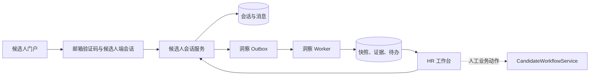

# 候选人沟通与 HR 待办中心技术实现方案

> 文档状态：方案评审稿
> 版本：v1.0
> 更新日期：2026-07-15
> 对应产品文档：[候选人沟通与HR待办中心产品需求文档](候选人沟通与HR待办中心产品需求文档.md)

## 1. 目标与架构边界

本方案实现“候选人消息 → 内部会话洞察 → HR 待办”的第一期闭环。候选人通过邮箱验证码访问已有投递并发送文本消息；HR 在内部工作台人工回复。模型只生成结构化快照和待办建议，不发送外部消息、不创建面试、不修改候选人正式状态。

现有 `AssistantConversationModel` 仅服务内部 HR 招聘助手，按员工 `user_id` 归属；现有 `CandidateProcessAgent` 负责候选人评分、邮件协商和面试等流程。二者均不直接扩展为本功能：

- 候选人会话需要独立的外部身份认证、候选人可见性和消息权限；
- 洞察是可评测的数据生产链路，不应和内部 HR 聊天记录或流程 Agent 的 checkpoint 混存；
- 正式状态变更、邮件和日程等副作用继续由 `CandidateWorkflowService` 及其领域 Service 负责。



## 2. 数据模型与迁移

新增 `models/candidate_communication.py`，并在 `models/__init__.py` 注册；新增一条 Alembic 迁移。所有新表继承 `BaseModel` 的字符串主键、`created_at` 和 `updated_at` 约定。

### 2.1 候选人端认证

| 对象 | 关键字段与约束 | 说明 |
| --- | --- | --- |
| `candidate_portal_sessions` | `email`、`expires_at`、`revoked_at`、`last_seen_at` | 候选人端 JWT 的服务端会话记录；不创建或复用内部 `users` 账号。 |
| Redis 登录挑战 | 规范化邮箱、验证码哈希、错误次数、过期时间、发送冷却 | 使用 `candidate_portal:login:{email_hash}` 键；不持久化明文验证码。 |

验证码有效期为 10 分钟，最多尝试 5 次，同一邮箱 60 秒内只允许发送一次。发送与验证接口对不存在投递的邮箱也返回统一成功文案，避免暴露候选人是否存在；仅在验证码验证通过后查询该邮箱下的投递。JWT 必须使用候选人专用 `audience` 和 `actor_type=candidate_portal` 声明，且携带 `sid`、规范化邮箱和过期时间。认证依赖校验签名、声明、服务端 session 未撤销和邮箱匹配，不接受内部员工 Token。

### 2.2 会话与消息

| 表 | 关键字段与索引 | 规则 |
| --- | --- | --- |
| `candidate_conversations` | `candidate_id`（唯一）、`owner_user_id`、`channel`、`status`、`last_message_at` | 一条 `CandidateModel` 已对应一个职位投递，因此一个候选人记录只创建一个 Web 会话；`owner_user_id` 初始化为职位创建人。 |
| `candidate_conversation_messages` | `conversation_id`、`sender_type`、`sender_user_id`、`content`、`client_message_id`、`created_at` | `sender_type` 为 `candidate` 或 `hr`；唯一约束 `(conversation_id, client_message_id)` 保证客户端重试不重复写入。 |

`candidate_conversations` 通过候选人记录间接绑定职位，禁止新增无 `candidate_id` 的通用会话。消息首期仅存文本，`content` 上限 10,000 字符；候选人和 HR 消息都向候选人端可见，内部洞察数据完全不放入消息表。

### 2.3 洞察、证据与待办

| 表 | 关键字段 | 说明 |
| --- | --- | --- |
| `candidate_conversation_insights` | `conversation_id`（唯一）、`version`、`source_message_id`、`summary`、`structured_data`、`model_name`、`prompt_version`、`status` | 当前快照；`source_message_id` 是已纳入快照的消息水位线。 |
| `candidate_conversation_evidences` | `insight_id`、`message_id`、`field_path` | 记录每个摘要字段、事实或风险到消息的证据关联。 |
| `candidate_follow_up_tasks` | `conversation_id`、`candidate_id`、`position_id`、`owner_user_id`、`dedupe_key`、`task_type`、`priority`、`status`、`rationale`、`due_at` | HR 待办；任务不改变候选人正式状态。 |
| `candidate_task_evidences` | `task_id`、`message_id` | 记录待办的触发证据。 |
| `candidate_insight_outbox` | `conversation_id`、`source_message_id`、`status`、`attempt_count`、`available_at`、`locked_at`、`last_error` | 可靠地驱动异步洞察任务；消息事务提交后才能消费。 |

`structured_data` 使用 JSON 保存经 Pydantic 校验后的结构化内容；正式枚举字段仍使用数据库 Enum。待办只允许 `reply_candidate`、`confirm_interview_information`、`follow_up_materials`、`review_risk` 四种 `task_type`；状态为 `pending`、`in_progress`、`done`、`closed`。

为避免开放待办重复，PostgreSQL 应建立部分唯一索引：`(conversation_id, dedupe_key)` 在 `status in ('pending', 'in_progress')` 时唯一。`dedupe_key` 由 `task_type + 规范化事项对象` 生成，例如 `confirm_interview_information:availability`。

## 3. 服务划分与处理流程

### 3.1 服务职责

| 服务 | 职责 |
| --- | --- |
| `CandidatePortalAuthService` | 发送和校验邮箱验证码、签发候选人端 Token、撤销候选人端 Session。 |
| `CandidateConversationService` | 候选人/HR 授权、创建或加载会话、消息持久化、写入 outbox；不调用 LLM。 |
| `CandidateConversationInsightService` | 领取 outbox、加载增量上下文、调用模型、校验洞察、更新快照和待办。 |
| `CandidateFollowUpTaskService` | 任务列表、状态变更、幂等创建或更新、证据关联。 |
| `CandidateWorkflowService` | 保持现有职责，处理正式候选人流程、面试及其他副作用；不负责会话摘要。 |

Repository 只处理本模块表的查询、加锁和写入。Router 只完成认证依赖、请求校验和 HTTP 映射；不得在 Router 或模型 Tool 中直接写正式流程状态。

### 3.2 消息写入事务

候选人和 HR 发消息共享同一写入流程：

1. 根据 actor 类型验证候选人邮箱归属或 HR 的 `CandidatePolicy` 可见权限。
2. 加载或创建候选人对应的会话，并校验会话状态为 `active`。
3. 以 `client_message_id` 做幂等写入；重复请求返回已创建的同一条消息。
4. 在同一数据库事务中更新 `last_message_at`，并插入 `candidate_insight_outbox`。
5. 提交后通过 `BackgroundTasks` 触发一次轻量 worker；worker 异常只记录日志，未消费 outbox 留待重试。

消息接口立即返回已保存消息和 `insight_status=pending`，不等待模型调用。候选人端无需也不得读取洞察状态；HR 端读取会话时可看到最新快照状态。

### 3.3 洞察 Worker

新增 `tasks/candidate_conversation_tasks.py`：

- `run_candidate_insight_batch_task(limit=20)`：BackgroundTask 入口，捕获异常并记录日志；
- `run_candidate_insight_batch(limit=20)`：由定时任务或运维命令重复调用，消费到期的 pending/failed outbox；
- 每条 outbox 用 `SELECT ... FOR UPDATE SKIP LOCKED` 领取，写入 `locked_at` 后执行；避免多 worker 重复处理。

Worker 对单个事件的处理如下：

1. 读取当前洞察水位线后的全部可见消息；若事件消息不晚于当前水位线，标记为成功并退出。
2. 读取候选人姓名、职位标题、正式候选人状态、当前快照和未完成待办；不传递简历全文、联系方式或内部 HR 助手历史。
3. 调用结构化输出模型，获得 `CandidateConversationInsightSchema`。
4. 验证枚举、字符串长度、证据消息 ID 均属于本次输入，以及候选人/职位 ID 一致。
5. 事务内按乐观水位线更新快照、替换本版本证据，并调用任务服务 upsert 待办。
6. 成功后标记 outbox `succeeded`；暂时性模型或网络错误按指数退避重试，达到最大次数后标记 `failed` 并保留错误摘要。

同一会话的并发事件必须按消息时间顺序收敛：更新快照时附带 `source_message_id` 和版本条件；若发现已被更晚消息覆盖，则放弃旧结果并重新消费当前最新 outbox，绝不回退快照。

### 3.4 结构化输出契约

新增 `schemas/candidate_communication_schema.py`。模型输出必须通过 `CandidateConversationInsightSchema`：

```json
{
  "summary": "候选人询问算法工程师岗位的薪资范围，并表示下周二晚上可参加面试。",
  "intent": "salary_consultation",
  "communication_stage": "waiting_hr_reply",
  "confirmed_facts": [
    {"text": "候选人下周二晚上可参加面试", "evidence_message_ids": ["msg_1"]}
  ],
  "candidate_requests": ["了解薪资范围"],
  "candidate_commitments": ["下周二晚上可参加面试"],
  "risks": [],
  "next_step": "HR 核实该职位可公开的薪资口径并回复候选人。",
  "confidence": 0.91,
  "task_candidates": [
    {
      "task_type": "reply_candidate",
      "priority": "high",
      "dedupe_key": "reply_candidate:salary_consultation",
      "rationale": "候选人主动提出薪资咨询。",
      "evidence_message_ids": ["msg_1"],
      "confidence": 0.91
    }
  ]
}
```

模型提示词必须明确：只输出 JSON；不推断未在输入中出现的事实；不得生成外发文案、状态变更、面试安排或薪资承诺；风险、冲突与低置信应明确标记。`confidence < 0.75` 的任务候选不创建待办，但保留洞察结果和评测日志；字段证据缺失或不属于输入消息时整个结果判为校验失败。

待办优先级及建议截止时间由服务端规则决定，而非模型决定：

| 条件 | 优先级 | 建议截止时间 |
| --- | --- | --- |
| 主动咨询、明确可面时间、投诉或风险 | high | 创建后 4 小时 |
| 资料补充、流程确认 | medium | 创建后 1 个工作日 |
| 一般信息补充 | low | 创建后 3 个工作日 |

首期不因 HR 发送一条消息自动关闭待办，避免“已回复”与“已解决”混淆；负责人必须显式将任务更新为 `done` 或 `closed`。

## 4. API 与鉴权设计

### 4.1 候选人端接口

前缀：`/candidate-portal`。所有读取和写入接口使用 `get_current_candidate_portal_session` 依赖，而不是 `get_current_user`。

| 方法 | 路径 | 行为 |
| --- | --- | --- |
| `POST` | `/auth/code` | 请求邮箱验证码；始终返回统一受理响应。 |
| `POST` | `/auth/verify` | 校验验证码，确认至少一条投递后签发候选人端 Token。 |
| `POST` | `/auth/logout` | 撤销当前候选人端 session。 |
| `GET` | `/applications` | 返回当前邮箱匹配的已有投递。 |
| `GET` | `/applications/{candidate_id}/conversation` | 返回该投递的候选人可见会话和消息。 |
| `POST` | `/applications/{candidate_id}/conversation/messages` | 发送候选人文本消息；请求携带 `client_message_id`。 |

对于不属于当前已验证邮箱的 `candidate_id`，候选人端统一返回 404。候选人端响应不包含内部摘要、待办、HR 内部用户 ID、模型名称、错误信息或 outbox 状态。

### 4.2 HR 端接口

前缀：`/candidate-communications`。使用既有 `get_current_user` 和候选人资源权限校验。

| 方法 | 路径 | 行为 |
| --- | --- | --- |
| `GET` | `/{candidate_id}` | 返回候选人、职位、正式状态、全部可见消息、内部洞察和关联待办。 |
| `POST` | `/{candidate_id}/messages` | HR 人工发送消息；同样要求 `client_message_id`。 |
| `GET` | `/tasks` | 按负责人、状态、优先级、职位、逾期筛选任务中心。 |
| `PATCH` | `/tasks/{task_id}` | 负责人更新任务状态和处理备注；仅允许状态合法迁移。 |

默认负责人取 `candidate.position.creator_id`。候选人被删除或职位不可访问时，服务端返回不泄露资源存在性的 404。系统管理员的范围遵循既有候选人策略，不单独在会话模块放宽权限。

## 5. 前端集成契约

候选人端和 HR 工作台位于配套前端仓库，后端只提供稳定 JSON API。首期前端需实现：

- 候选人：邮箱验证、我的投递、文本会话；不渲染任何内部洞察字段。
- HR：候选人会话页面、内部洞察卡片、证据消息定位、待办入口；所有回复均为人工编辑框。
- 任务中心：默认“我的待处理”列表，支持产品文档约定的筛选字段和显式完成/关闭。

消息发送使用乐观展示配合 `client_message_id`，网络重试保持同一 ID。会话历史按 `created_at` 正序分页；首期使用轮询刷新 HR 端快照与待办，不增加 SSE 或 WebSocket。

## 6. 实施顺序

1. 新增模型、迁移、Repository 与基础 Schema，先完成候选人会话、消息和待办的纯数据库测试。
2. 实现候选人端验证码/session 鉴权和投递范围查询，确保不复用员工账号体系。
3. 实现候选人与 HR 的消息接口，在同一事务写入 outbox，并接入 HR 工作台读取接口。
4. 实现结构化洞察 Schema、提示词、Worker、快照水位线和待办幂等 upsert；先使用测试模型或 fixture 覆盖。
5. 接入任务中心查询与状态更新，补齐前端页面和接口联调。
6. 建设脱敏评测集、离线评测脚本和运行指标；通过影子模式验证后再进入真实 HR 试点。

## 7. 测试与验收

### 7.1 单元测试

- 邮箱规范化、验证码过期/冷却/次数限制、候选人 session 撤销与专用 JWT 声明。
- 同邮箱多投递、不同邮箱隔离、候选人与 HR 的资源权限拒绝。
- 消息 `client_message_id` 幂等、消息排序、outbox 与消息同事务写入。
- 结构化输出校验：未知枚举、越权证据、缺少证据、低置信任务和 JSON 解析失败。
- 待办去重、优先级/截止时间规则、合法状态迁移和并发 upsert。

### 7.2 集成测试

1. 候选人验证邮箱后，只能读取并向自己的一个或多个投递会话发消息。
2. HR 回复与候选人消息均会创建可消费 outbox；worker 成功后产生内部快照和带证据待办。
3. 相同候选人再次提出同一未解决事项时，更新原待办而非重复创建。
4. worker 失败或模型结果非法时，消息仍可读取、正式候选人状态不变、未产生外发消息；outbox 可重试。
5. 无权限 HR、候选人和错误 Token 均不能读取摘要、待办或其他候选人消息。

### 7.3 运行指标

记录并监控：验证码发送/验证失败率、消息写入成功率、outbox 积压量与重试次数、洞察成功率与延迟、结构化校验失败率、待办重复率、人工完成率和评测集指标。日志只记录资源 ID、任务状态、模型/提示词版本和错误类型，不记录原始会话正文或验证码。

## 8. 风险与约束

- 不使用 `CandidateProcessAgent` 的 `candidate-process:{candidate_id}:{position_id}` 作为候选人端会话状态；该 thread_id 专供正式流程 Agent，避免把候选人聊天和流程 checkpoint 混合。
- 洞察任务必须具备 outbox、幂等和重试，不能只依赖进程内 `BackgroundTasks`；后者只负责提交后的快速唤醒。
- 模型服务不可用时降级为“消息已送达、洞察待处理”，不得阻塞候选人/HR 的消息写入。
- 薪资、录用、拒绝、投诉和其他高风险内容只生成内部待办与风险提示，首期绝不由模型外发或执行业务动作。
- 所有后续涉及面试、邮件、日程的动作必须调用既有领域 Service，并在 Service 层继续保证幂等性和审计。
